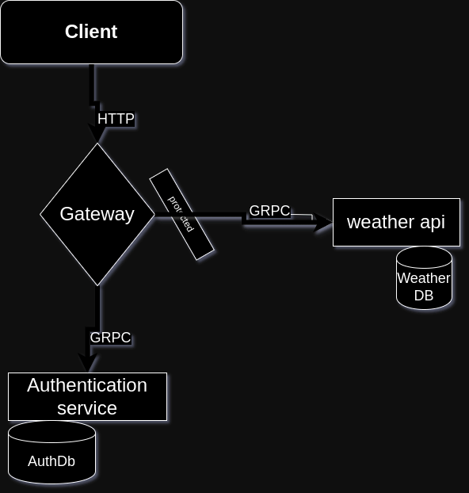

# Weather App

Welcome to the Weather App project! This application serves as a comprehensive API gateway for fetching and storing weather data from various sources. It offers a seamless experience for users to register, login, and access up-to-date weather information.

## Getting Started

Follow these instructions to get the Weather App up and running on your system.

### Prerequisites

- Docker
- Make (Optional)

### Installation

1. Clone the repository:

   ```bash
   git clone https://github.com/Tesfay-Hagos/weather-app
   cd weather-app
   ```

2. Start the application using Docker:
   ```bash
   make start
   ```

### Accessing the Swagger UI

After starting the application, you can interact with the API through the Swagger UI:

1. Open your browser and navigate to:

   ```
   http://localhost:8000/v1/swagger/index.html
   ```

2. Explore the available API endpoints and test the functionalities of the Weather App.

## Optional Commands

Restart the app

```
  make restart
```

Clean your docker

```
  make clean
```

Stop all services

```
  make stop
```

## Services Overview

- **Gateway Service**: Primary entry point for all API requests.
- **Authentication Service**: Manages user registration and login processes.
- **Weather API Service**: Retrieves weather data from external APIs and stores it in MongoDB.
- **MongoDB**: Storage solution for weather data.
- **PostgreSQL**: storage for Authentication services

## Technologies Used

- Golang
- gRPC
- Docker
- Docker Compose
- PostgreSQL
- MongoDB

## The Services are designed as below



## Contributing

Contributions are welcome! Fork the repository, make your changes, and submit pull requests. For issues or suggestions, open an issue on GitHub.

## License

This project is licensed under the MIT License.
